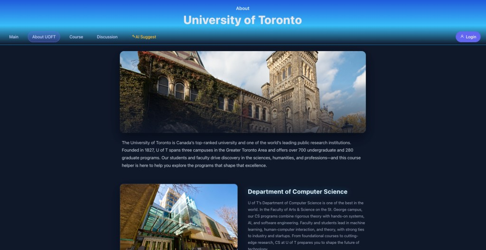
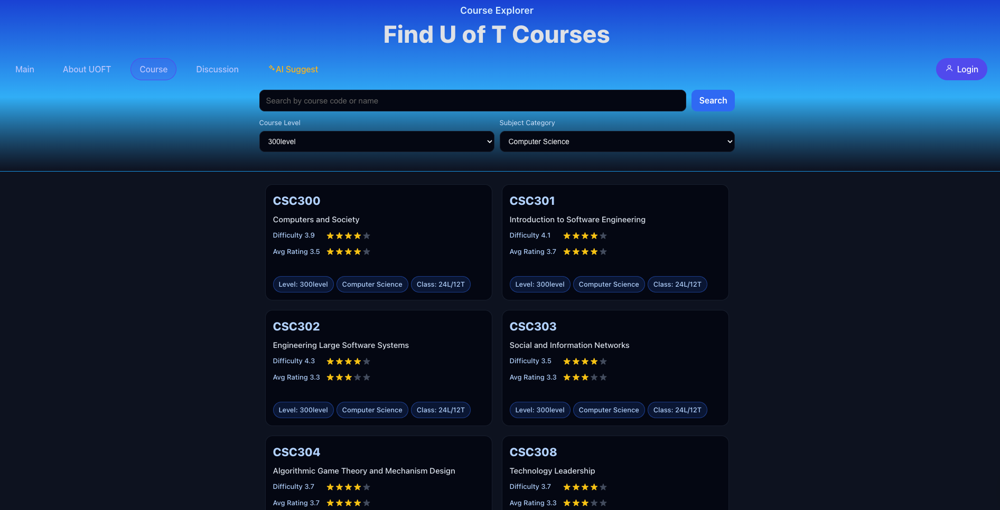
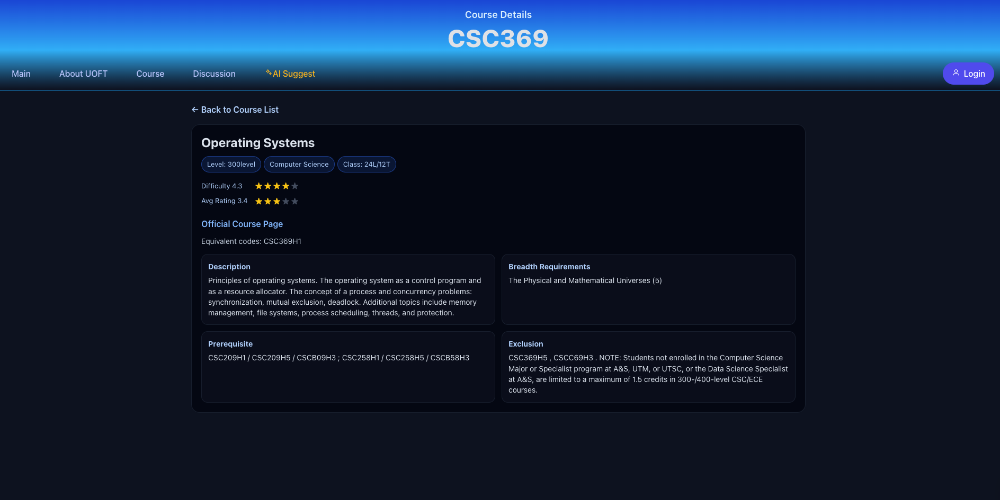
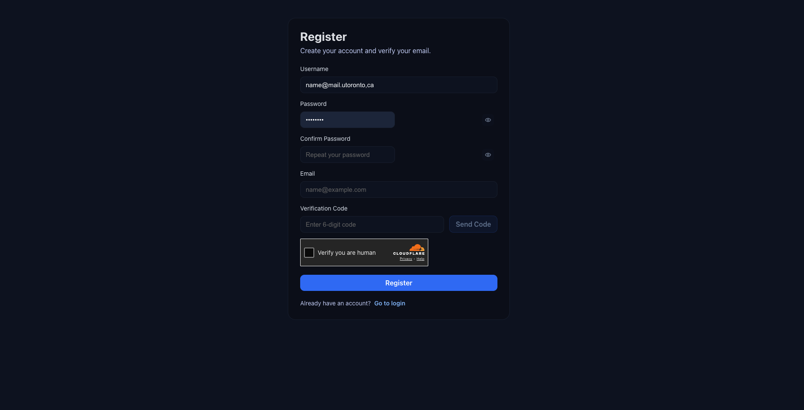

# U of T Course Helper — Web App Showcase

A short overview of the main pages and features of the **U of T Course Helper** web application for University of Toronto students.
Link to UofT Course Helper: https://app.uoftcoursehelper.com/
Link to my info website: https://aws.yiyangweb.top/
---

## Main / Homepage

Landing page with search, latest news, and discussion preview.

- **Search bar** — “Search your question here…” with voice search
- **Latest News** — Auto-updated weekly with the top 5 events; each item shows title, date, and short description
- **Top Discussion** — Placeholder for featured and trending discussion threads (coming soon)
- **Navigation** — Main, About UOFT, Course, Discussion, AI Suggest

---

## About U of T

Introduction to the University of Toronto and the Department of Computer Science.

- **University overview** — Rank, history, campuses, and programs
- **Department of Computer Science** — Programs, research areas, and industry links
- **Layout** — Image + text blocks for quick reading

---

## Course Explorer

Browse and filter U of T courses.

- **Search** — By course code or name
- **Filters** — Course level (e.g. 300-level), subject (e.g. Computer Science)
- **Course cards** — Code, title, difficulty, average rating, star display, and tags (level, subject, class format e.g. 24L/12T)
- **Grid layout** — Scrollable list of courses (e.g. CSC300, CSC301, CSC302, …)

---

## Course Details

Full details for a single course (e.g. CSC369 — Operating Systems).

- **Back link** — “← Back to Course List”
- **Header** — Course code, title, level, subject, class format
- **Ratings** — Difficulty and average rating with star display
- **Official link** — Link to official course page and equivalent codes
- **Info blocks** — Description, breadth requirements, prerequisite, exclusion

---

## Register

Create an account and verify email.

- **Fields** — Username (e.g. @mail.utoronto.ca), Password, Confirm Password, Email, 6-digit verification code
- **Actions** — “Send Code” for verification, “Register” to submit
- **Human verification** — Checkbox + Cloudflare
- **Login** — “Already have an account? Go to login”

---

## Navigation Overview

| Page        | Purpose                          |
|------------|-----------------------------------|
| **Main**   | Home, search, news, discussion   |
| **About UOFT** | University & CS department info |
| **Course** | Explorer + course details        |
| **Discussion** | Forums (coming soon)          |
| **AI Suggest** | AI-assisted suggestions      |
| **Login**  | User authentication              |

---

*Screenshots reflect the current UI. For the live app or source code, see the main repository.*
